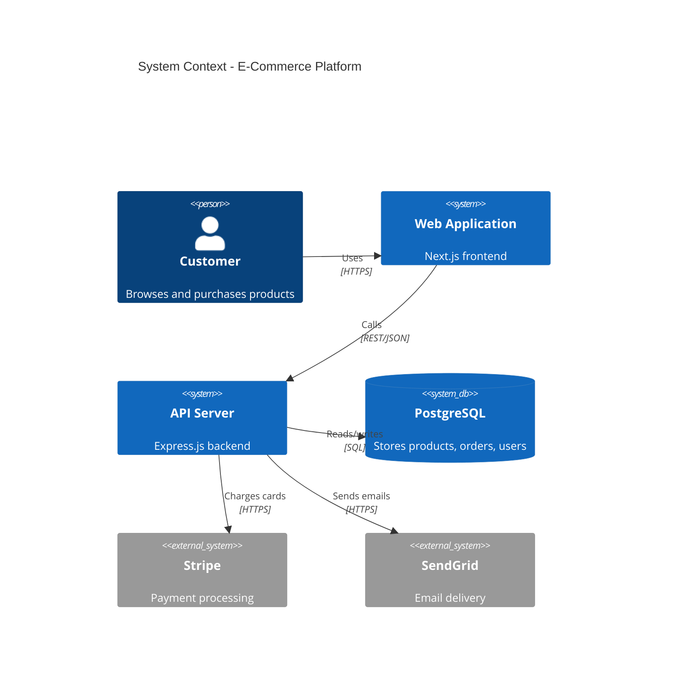

# Architecture Diagram Skill

A [Claude Code Skill](https://docs.anthropic.com/en/docs/claude-code/skills) that generates **C4 architecture diagrams** by analyzing your codebase. Point it at any project and get a visual architecture diagram — no manual drawing required.

## Two Output Modes

| Mode | What it does | Setup needed? |
|------|-------------|---------------|
| **Mermaid** | Generates Mermaid diagram code you can render in GitHub, VS Code, Notion, docs, etc. | None |
| **IcePanel** | Pushes model objects, connections, diagrams, and flows to your [IcePanel](https://icepanel.io) workspace via REST API | IcePanel API key |

The skill asks which mode you want at the start of every interaction.

## What It Can Do

- **Full system diagrams** — analyze an entire project and generate C4 architecture at any level (System Context, Container, Component)
- **Monorepo scoping** — focus on a specific subdirectory (e.g. `services/payments`)
- **Topic-focused diagrams** — trace a specific business process across the codebase (e.g. "payment flow", "user login", "order processing")
- **Flow/sequence diagrams** — interactive step-by-step flow creation with branching, parallel paths, and error handling
- **Visual review** — renders Mermaid diagrams to images and visually inspects them for readability before presenting to you (overlapping labels, cramped layouts, arrow spaghetti, etc.)
- **Self-learning knowledge base** — learns IcePanel API and Mermaid syntax from official docs, persists knowledge for future sessions

## Quick Start

### Install as a Claude Code Skill (recommended)

```bash
# Clone the repo
git clone https://github.com/robertanton81/architecture-diagram-skill.git

# Install globally (available in all projects)
mkdir -p ~/.claude/skills/architecture-diagrams
cp -r architecture-diagram-skill/skill/* ~/.claude/skills/architecture-diagrams/
```

Then in any project, use the skill in Claude Code:

```
/architecture-diagrams
```

### Usage Examples

```
# Full system diagram
/architecture-diagrams

# Monorepo — diagram a specific service
/architecture-diagrams services/payments

# Topic-focused — trace a business process
/architecture-diagrams payment flow

# Sequence diagram for a specific scenario
/architecture-diagrams user login flow
```

The skill will:
1. Ask what you want to diagram (if not specified)
2. Ask which output mode (Mermaid or IcePanel)
3. Analyze the codebase
4. Present its findings and ask clarifying questions
5. Generate the diagram
6. Visually review the rendered diagram for readability (Mermaid mode)
7. Offer refinements and follow-up diagrams

## Mermaid Mode

Works out of the box — no setup required. The skill generates Mermaid code that renders natively in:

- GitHub (in `.md` files and PR descriptions)
- VS Code (with Mermaid extensions)
- Notion, Confluence, and most documentation tools

Example output:

````

````

## IcePanel Mode

### Setup

1. Get your API key from [IcePanel Settings](https://app.icepanel.io)
2. Set environment variables (either in your shell or in Claude Code's MCP config):

```bash
export ICEPANEL_API_KEY=your-api-key
export ICEPANEL_ORGANIZATION_ID=your-org-id
```

Or if using the SDK agent, create a `.env` file:

```bash
cp .env.example .env
# Edit .env with your credentials
```

3. The IcePanel MCP server must be configured in Claude Code. Add to `~/.claude/.mcp.json`:

```json
{
  "mcpServers": {
    "icepanel": {
      "command": "npx",
      "args": ["-y", "@icepanel/mcp-server@latest"],
      "env": {
        "API_KEY": "your-api-key",
        "ORGANIZATION_ID": "your-org-id"
      }
    }
  }
}
```

### IcePanel Capabilities

- **Read** existing architecture via the IcePanel MCP server
- **Write** new model objects, connections, diagrams, and flows via REST API (`push_to_icepanel.py`)
- **Merge** codebase analysis with existing IcePanel data (avoids duplicates)
- **Interactive flows** — step-by-step sequence diagrams with branching and parallel paths

## Running as an SDK Agent

The repo also includes a standalone TypeScript agent built with the [Claude Agent SDK](https://docs.anthropic.com/en/docs/claude-agent-sdk):

```bash
npm install

# Mermaid mode (no credentials needed)
npm start -- "Analyze this project and create a Mermaid C4 diagram"

# IcePanel mode (requires .env credentials)
npm start -- "Create a C4 diagram of this project in IcePanel"

# Interactive REPL mode
npm run interactive

# Topic-focused
npm start -- "Diagram the payment flow in this project"

# Monorepo scoping
npm start -- "Create architecture diagram for services/auth"
```

## Project Structure

```
skill/                          # The portable Claude Skill
  SKILL.md                      # Skill definition (frontmatter + instructions)
  scripts/
    analyze_codebase.py         # Codebase scanner (Python 3.10+)
    push_to_icepanel.py         # IcePanel REST API writer
  knowledge/                    # Self-learning knowledge base
    .index.md                   # Index of all knowledge + doc URLs
    shared/c4-model.md          # C4 concepts (mode-agnostic)
    icepanel/                   # IcePanel API knowledge (5 files)
    mermaid/                    # Mermaid syntax knowledge
  references/                   # Static references
    c4-mapping.md               # C4 type mapping tables
    icepanel-api.md             # IcePanel API reference
    plan-format.md              # Plan JSON schema
    setup.md                    # Setup guide
src/                            # SDK agent (TypeScript)
  index.ts                      # Single-prompt mode
  interactive.ts                # Interactive REPL mode
```

## Visual Review (Mermaid Mode)

In Mermaid mode, the skill doesn't just generate code — it renders the diagram to an image and visually inspects it before showing it to you. This catches common readability issues:

- Overlapping or truncated labels
- Cramped layouts with elements too close together
- Too many elements (suggests splitting into multiple diagrams)
- Arrow spaghetti (crossing connections)
- Poor visual flow direction

The agent iterates up to 3 times to fix issues automatically. This uses the [Mermaid CLI](https://github.com/mermaid-js/mermaid-cli) (`mmdc`) via `npx` — no manual installation needed. If rendering fails for any reason, the skill gracefully falls back to code-only presentation.

## Requirements

- **Claude Code** (for skill usage) or **Claude Agent SDK** (for standalone agent)
- **Python 3.10+** (for `analyze_codebase.py`)
- **Node.js 18+** (for SDK agent and Mermaid CLI rendering)
- **IcePanel API key** (only for IcePanel mode)

## Design Philosophy

The skill follows a strict **"never assume — always ask"** rule. When anything is ambiguous, it stops and asks rather than guessing. This means:

- It asks which C4 level to use
- It asks how to classify ambiguous modules
- It asks about scope boundaries for topic-focused diagrams
- It asks about branching and error paths for flows
- It presents findings for confirmation before generating

This produces better diagrams because architecture decisions shouldn't be made by an AI guessing.

## License

MIT
