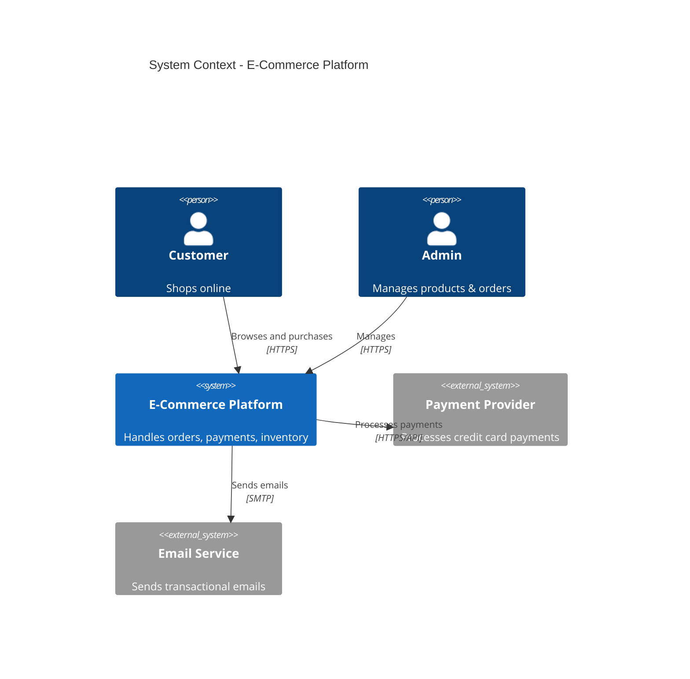
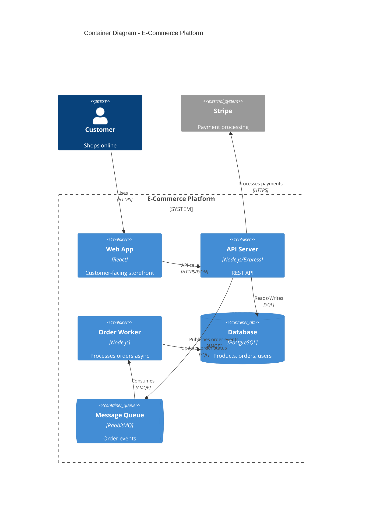
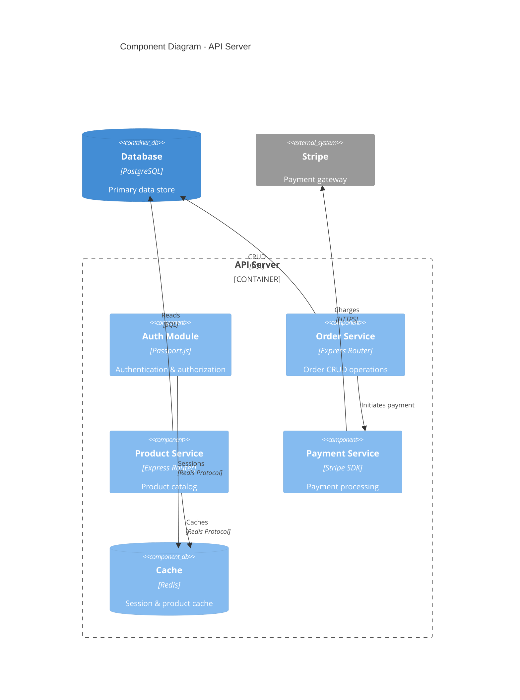
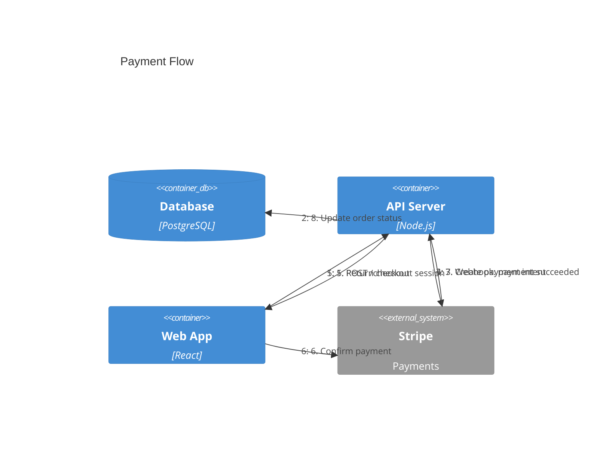

# Mermaid C4 Diagram Syntax

**Learned from**: https://mermaid.js.org/syntax/c4.html

## Diagram Types

| Type | Use |
|---|---|
| `C4Context` | System Context (C1) — systems + actors |
| `C4Container` | Container (C2) — apps, databases, queues inside a system |
| `C4Component` | Component (C3) — modules inside a container |
| `C4Dynamic` | Dynamic — numbered sequence of interactions |
| `C4Deployment` | Deployment — infrastructure nodes |

## Element Functions

All elements follow: `Element(alias, label, ?optional_params...)`

### Person
```
Person(alias, "Label", "Description")
Person_Ext(alias, "Label", "Description")
```

### System (C1)
```
System(alias, "Label", "Description")
System_Ext(alias, "Label", "Description")
SystemDb(alias, "Label", "Description")
SystemQueue(alias, "Label", "Description")
SystemDb_Ext(alias, "Label", "Description")
SystemQueue_Ext(alias, "Label", "Description")
```

### Container (C2)
```
Container(alias, "Label", "Technology", "Description")
ContainerDb(alias, "Label", "Technology", "Description")
ContainerQueue(alias, "Label", "Technology", "Description")
Container_Ext(alias, "Label", "Technology", "Description")
ContainerDb_Ext(alias, "Label", "Technology", "Description")
ContainerQueue_Ext(alias, "Label", "Technology", "Description")
```

### Component (C3)
```
Component(alias, "Label", "Technology", "Description")
ComponentDb(alias, "Label", "Technology", "Description")
ComponentQueue(alias, "Label", "Technology", "Description")
Component_Ext(alias, "Label", "Technology", "Description")
```

### Deployment Nodes
```
Deployment_Node(alias, "Label", "Type", "Description")
Node(alias, "Label", "Type", "Description")
Node_L(alias, "Label", "Type", "Description")
Node_R(alias, "Label", "Type", "Description")
```

## Boundaries (grouping)

```
System_Boundary(alias, "Label") {
    Container(...)
    Container(...)
}

Container_Boundary(alias, "Label") {
    Component(...)
}

Enterprise_Boundary(alias, "Label") {
    System(...)
}

Boundary(alias, "Label", "type") {
    ...
}
```

## Relationships

```
Rel(from, to, "Label")
Rel(from, to, "Label", "Technology")
Rel(from, to, "Label", "Technology", "Description")
BiRel(from, to, "Label")
Rel_U(from, to, "Label")     // arrow points up
Rel_D(from, to, "Label")     // arrow points down
Rel_L(from, to, "Label")     // arrow points left
Rel_R(from, to, "Label")     // arrow points right
Rel_Back(from, to, "Label")  // return/reply
```

For dynamic diagrams: `Rel(from, to, "Label")` — sequence is determined by statement order, not index.

## Layout Configuration

```
UpdateLayoutConfig($c4ShapeInRow="3", $c4BoundaryInRow="1")
```

## Styling

```
UpdateElementStyle(elementAlias, $bgColor="blue", $fontColor="white", $borderColor="darkblue")
UpdateRelStyle(from, to, $textColor="red", $lineColor="blue", $offsetX="-40", $offsetY="60")
```

## Complete Examples

### C1 — System Context


### C2 — Container


### C3 — Component


### C4Dynamic — Sequence


## Tips

- Aliases must be unique across the entire diagram
- Use `_Ext` suffix for external systems/containers/components
- Use `Db` suffix for databases, `Queue` suffix for message queues
- Boundaries can be nested (System_Boundary inside Enterprise_Boundary)
- Statement order controls layout — place important elements first
- `UpdateLayoutConfig($c4ShapeInRow="3")` to control grid width

## Readability Best Practices

### Element count per diagram
- **Ideal**: 5–10 elements (clear, spacious)
- **Acceptable**: 10–15 elements (still readable with good layout)
- **Too many**: >15 elements — split into an overview diagram + drill-down diagrams
- When splitting, create a C1 overview first, then C2 drill-downs per system boundary

### Layout configuration
| Element count | Recommended `$c4ShapeInRow` |
|---|---|
| 3–5 | `"2"` or `"3"` |
| 6–9 | `"3"` or `"4"` |
| 10–15 | `"4"` or `"5"` |

Always include `UpdateLayoutConfig` when >5 elements to prevent cramped layouts.

### Label guidelines
- **Element labels**: max 3–4 words (e.g. "Order Service", not "The Order Processing Service Module")
- **Descriptions**: max 8–10 words — one concise sentence
- **Relationship labels**: max 3–4 words (e.g. "Sends events", not "Sends order events to the message queue for processing")
- **Technology tags**: keep to the framework/protocol name (e.g. "Express.js", "gRPC", "PostgreSQL")
- If a label needs more detail, shorten the diagram label and explain in accompanying text

### Directional relationships for layout control
Use directional `Rel` variants to guide Mermaid's layout engine:
- `Rel_D(from, to, "Label")` — push `to` below `from` (most common)
- `Rel_R(from, to, "Label")` — push `to` to the right of `from`
- `Rel_L(from, to, "Label")` — push `to` to the left
- `Rel_U(from, to, "Label")` — push `to` above

Use these when:
- Actors should be at the top → `Rel_D(actor, system, ...)`
- Databases should be at the bottom → `Rel_D(service, db, ...)`
- External systems should be on the sides → `Rel_R(system, external, ...)`
- Two systems should be side-by-side → `Rel_R(systemA, systemB, ...)`

### Statement ordering
Mermaid renders elements roughly in declaration order:
1. Declare actors/users first (they appear at the top)
2. Declare the main system and its boundaries next
3. Declare external systems last (they appear at the bottom/sides)
4. Declare relationships after all elements
5. Within boundaries, declare left-to-right in the reading order you want

### Reducing arrow spaghetti
- Group tightly connected elements inside a `System_Boundary` or `Container_Boundary`
- Limit connections per element to 3–4 visible on any single diagram
- If an element has >4 connections, it may belong on a drill-down diagram instead
- Use `UpdateRelStyle(from, to, $offsetX="-40", $offsetY="20")` to nudge overlapping labels
